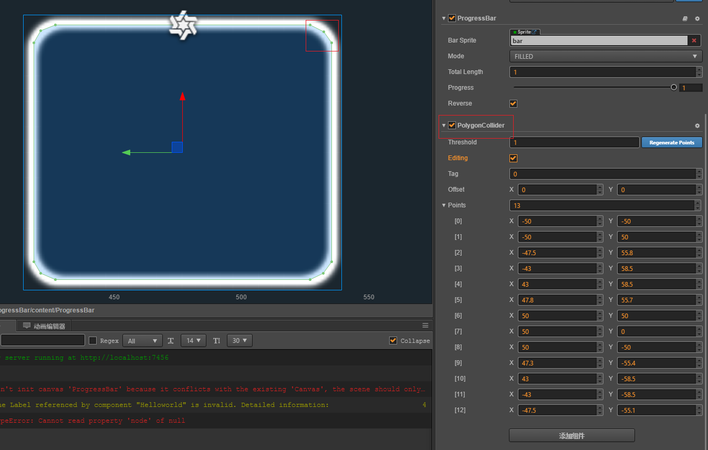
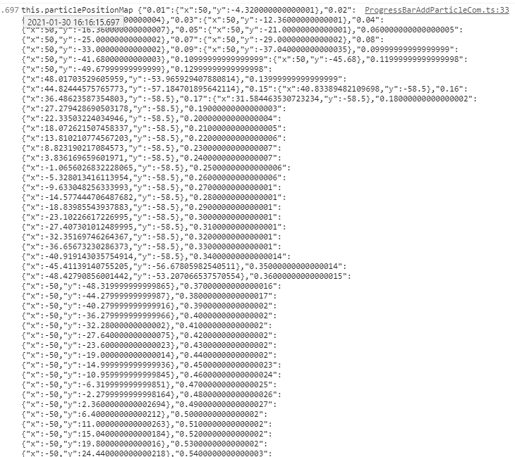
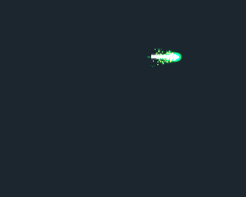
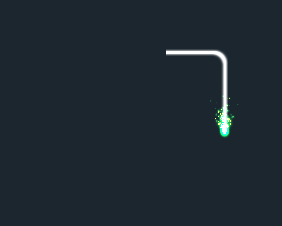

# cocos creator 进度条添加同步的粒子效果
## 设计思路
1. 进度条和粒子运动分开处理
2. 利用cc.PolygonCollider控件确定粒子运动轨迹

3. 根据扇形进度条角速度相同 计算出两点之间的运动所需时间
4. 使用cc.moveTo配合进度条调度生成粒子在不同进度下的位置信息
5. 项目中直接生成的使用粒子配置更加灵活和效率

## 调整效果
根据自己项目需求修改进度条时间
ProgressBarAddParticleCom.ts中
`
useConfig = false  //是否使用配置文件

`
生成配置拷贝保存为配置文件ParticlePositionMap.ts

## 使用粒子配置文件
`
    useConfig = true

     //粒子位置更新
    private updateParticlePosition(progress: number) {
        let position: cc.Vec2 = ParticlePositionMap[progress + '']
        if (position) {
            console.log(`progress:${progress}=>position:${position}`)
            this.particle.node.setPosition(position)
        }
    }
`
通过进度条调度同步更新粒子位置 灵活性更高

## 效果图

